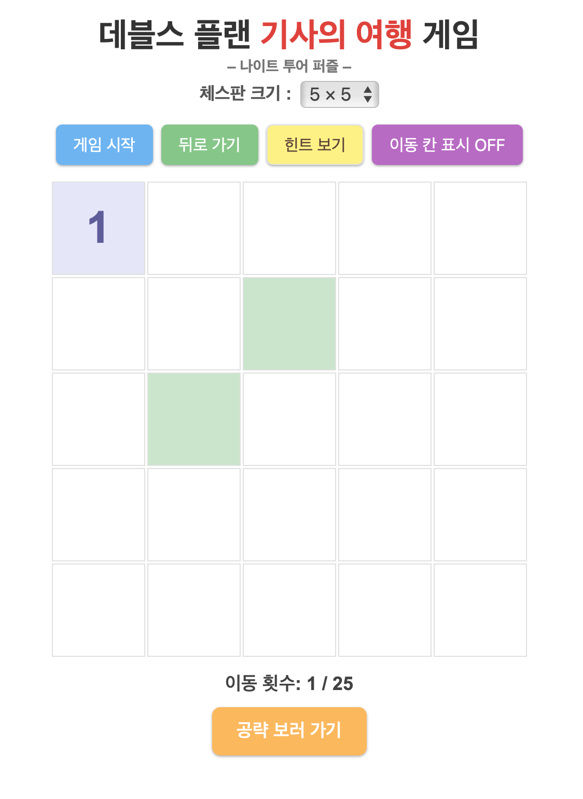

# 🐴 데블스 플랜 시즌2: 기사의 여행 게임  

안녕하세요! '기사의 여행' 블로그 글을 재미있게 읽어주시고, 제 게임에 관심을 가져주셔서 감사합니다.
글을 쓰면서 '이 게임을 직접 만들어보면 어떨까?' 하는 생각이 들었고, 조금씩 만들어 보다가 드디어 기본적인 기능을 완성했습니다.

제가 직접 만든 **'기사의 여행 (Knight's Tour)'** 게임 웹사이트를 소개합니다!

---

## 🌐 지금 바로 플레이해보세요!
**✨ 웹사이트 주소: [https://kimsol1134.github.io/Knight_tour/](https://kimsol1134.github.io/Knight_tour/) ✨**

---

블로그 글을 통해 '워스도프 규칙'도 배우고, '기사의 여행'이 어떤 게임인지 감을 잡으셨다면, 이제 직접 기사가 되어 체스판 위를 누벼볼 차례입니다! 제 웹사이트에서는 다음과 같은 기능들을 이용해 '기사의 여행'을 즐기실 수 있어요.

## 🚀 주요 기능

* **👑 다양한 보드 크기 선택 가능:**
    * 블로그에서 예시로 보여드렸던 5x5, 6x6, 7x7 보드는 물론이고,
    * 실제 체스판 크기이자 '데블스 플랜' 결승전에서 등장할지도 모르는 8x8 보드까지 준비되어 있답니다! 직접 도전해보세요!
* **💡 막힐 때는 '힌트 보기':**
    * "다음은 어디로 가야 할까?" 워스도프 규칙을 적용해보고 싶지만 아직 조금 어렵다면, '힌트 보기' 버튼을 눌러 도움을 받을 수 있어요. 규칙을 이해하는 데 도움이 될 거예요.
* **↩️ 실수는 '뒤로 가기'로 만회:**
    * "앗, 이쪽이 아니었네!" 하는 순간이 오더라도 괜찮아요. '뒤로 가기' 버튼으로 바로 이전 단계로 돌아가 다른 선택을 할 수 있습니다. 부담 없이 여러 경로를 탐색해보세요!

---

'기사의 여행'은 단순히 모든 칸을 방문하는 것을 넘어, 전략적인 사고와 문제 해결 능력을 길러주는 매력적인 퍼즐 게임이라고 생각해요. 제 웹사이트를 통해 여러분도 '기사의 여행'의 재미를 직접 느껴보시고, 워스도프 규칙을 실제로 적용해보면서 그 효과를 체감해보시면 좋겠습니다.

## ✨ 더욱 편리하게 즐겨보세요: 홈 화면에 추가하고 앱처럼 사용하기!

제 웹사이트는 PWA(Progressive Web App)로 만들어져서, 스마트폰 홈 화면에 추가하고 앱처럼 사용할 수 있습니다! 더 자주, 더 쉽게 방문하고 싶으시다면 아래 방법을 따라 추가해보세요.

**📱 Android (Chrome 브라우저 사용 시):**

1.  화면 오른쪽 위에 있는 세로 점 3개(⋮) 메뉴를 누르세요.
2.  '홈 화면에 추가(Add to Home screen)'를 선택하세요.
3.  아이콘과 이름을 확인한 후 '추가' 버튼을 누르면 끝!

**📱 iOS (Safari 브라우저 사용 시):**

1.  화면 아래쪽에 있는 공유 버튼(상자에서 위로 화살표가 나오는 모양)을 누르세요.
2.  여러 메뉴 중 '홈 화면에 추가'를 선택하세요.
3.  오른쪽 위에 있는 '추가'를 누르면 홈 화면에 예쁜 아이콘이 생긴답니다!

---

## 🛠️ 사용된 기술

이 게임은 다음의 기술들을 사용하여 만들어졌습니다:

* HTML
* CSS
* JavaScript

---

혹시 게임을 이용해보시면서 개선할 점이나 좋은 아이디어가 있다면 언제든지 피드백 부탁드립니다! (kimsol1134@naver.com)

이제, 블로그에서 얻은 지식을 바탕으로 멋지게 '기사의 여행'을 완주해보시는 건 어떨까요? 여러분의 도전을 응원합니다! 🚀